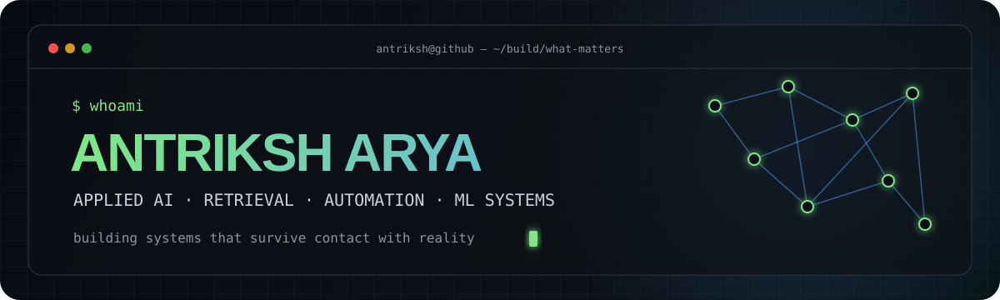
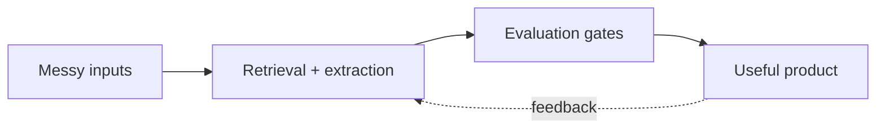

<div align="center">
  
</div>

<div align="center">
  <a href="https://antrskarya.vercel.app"></a>
  <a href="https://www.linkedin.com/in/antriksharya"></a>
  <a href="https://kaggle.com/antriksharya"></a>
  <a href="mailto:antriksh0704@gmail.com"></a>
</div>

<br />

I turn messy data and workflows into **AI systems people can actually use**. My sweet spot is the layer between a promising model and a dependable product: retrieval, evaluation, structured extraction, automation, and the backend glue that makes it all work.

```text
current_quest  → building Objection!, a rules-first AI courtroom simulator
recently       → Applied AI & Data Science @ CMN Labs
interested_in  → LLM products · retrieval systems · agents · production ML
operating_from → India (UTC+5:30)
```

## `> shipped_work`

<table>
  <tr>
    <td width="33%" valign="top">
      <h3>🔮 AURA</h3>
      <p>A grounded research companion that answers from retrieved paper evidence—not just model memory.</p>
      <p><code>Next.js</code> <code>Qdrant</code> <code>Gemini</code> <code>RAG</code></p>
      <a href="https://github.com/vdhkcheems/AURA"><b>source ↗</b></a> · <a href="https://aura-aa.vercel.app"><b>live ↗</b></a>
    </td>
    <td width="33%" valign="top">
      <h3>⚖️ Objection!</h3>
      <p>A courtroom strategy game where LLM dialogue is constrained by a locked, testable case-state engine.</p>
      <p><code>FastAPI</code> <code>Next.js</code> <code>Pydantic</code> <code>LLMs</code></p>
      <a href="https://github.com/vdhkcheems/objection"><b>active build ↗</b></a>
    </td>
    <td width="33%" valign="top">
      <h3>✍️ Essay Scorer</h3>
      <p>A fine-tuned DeBERTa-v3-large scoring pipeline exposed as a real-time inference API.</p>
      <p><code>PyTorch</code> <code>Transformers</code> <code>FastAPI</code> <code>NLP</code></p>
      <a href="https://github.com/vdhkcheems/Automated-Essay-Scorer"><b>source ↗</b></a>
    </td>
  </tr>
</table>

## `> proof_of_work`

<div align="center">

| `83.88 F1` | `1M+ records` | `11th / 50K+` | `3× medals` |
|:---:|:---:|:---:|:---:|
| role-matching holdout | shaped into business datasets | Amazon ML Challenge '25 | Kaggle competitions |

</div>

- Built an auditable prompt-optimization loop with deterministic splits and acceptance gates, lifting holdout F1 from **77.21 → 83.88**.
- Engineered hybrid retrieval with **Qdrant, SPLADE, and dense embeddings** across production datasets.
- Expanded browser-agent automation from **3 → 8 external platforms**.

## `> systems_i_reach_for`

<div align="center">
  
</div>

<br />



## `> signal`

<div align="center">
  
</div>

<details>
  <summary><b>off the clock</b></summary>
  <br />
  Anime, video games, and occasionally rebuilding a neural network from scratch just to make sure the abstractions still make sense.
</details>

<br />

<div align="center">
  <i>Open to applied AI, ML engineering, and data science roles where models meet messy reality.</i>
</div>
