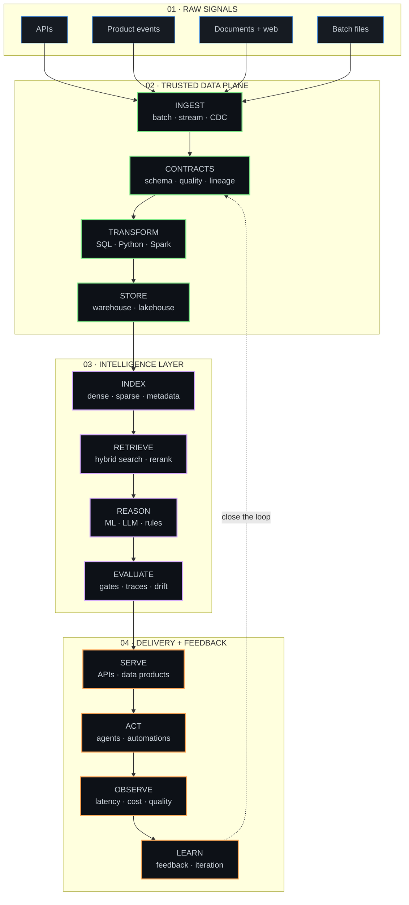

<div align="center">
  
</div>

<div align="center">
  <a href="https://antrskarya.vercel.app"></a>
  <a href="https://www.linkedin.com/in/antriksharya"></a>
  <a href="https://x.com/antrskarya"></a>
  <a href="https://kaggle.com/antriksharya"></a>
  <a href="mailto:antriksh0704@gmail.com"></a>
</div>

<br />

I turn messy data and workflows into **data + AI systems people can actually use**. My sweet spot is the layer between raw signals and a dependable product: pipelines, retrieval, evaluation, structured extraction, automation, and the backend glue that makes it all work.

> Currently building data systems as a **Data Engineering Intern** at [**New Engen**](https://www.newengen.com) ↗

```text
previously  → Data Science and Applied AI Intern @ CMN Labs
building_with  → data pipelines · LLM products · retrieval · automation
operating_from → India (UTC+5:30)
```

## `> shipped_work`

<table>
  <tr>
    <td width="33%" valign="top">
      <h3>🔮 AURA</h3>
      <p>A grounded research companion that answers from retrieved paper evidence—not just model memory.</p>
      <p><code>Next.js</code> <code>Qdrant</code> <code>Gemini</code> <code>RAG</code></p>
      <a href="https://github.com/vdhkcheems/AURA"><b>source ↗</b></a> · <a href="https://aura-aa.vercel.app"><b>live ↗</b></a>
    </td>
    <td width="33%" valign="top">
      <h3>⚖️ Objection!</h3>
      <p>A courtroom strategy game where LLM dialogue is constrained by a locked, testable case-state engine.</p>
      <p><code>FastAPI</code> <code>Next.js</code> <code>Pydantic</code> <code>LLMs</code></p>
      <a href="https://github.com/vdhkcheems/objection"><b>active build ↗</b></a>
    </td>
    <td width="33%" valign="top">
      <h3>✍️ Essay Scorer</h3>
      <p>A fine-tuned DeBERTa-v3-large scoring pipeline exposed as a real-time inference API.</p>
      <p><code>PyTorch</code> <code>Transformers</code> <code>FastAPI</code> <code>NLP</code></p>
      <a href="https://github.com/vdhkcheems/Automated-Essay-Scorer"><b>source ↗</b></a>
    </td>
  </tr>
</table>

## `> systems_i_reach_for`

<div align="center">
  
</div>

<br />

## `> the_systems_map`



## `> contribution_arcade`

<div align="center">
  <picture>
    <source media="(prefers-color-scheme: dark)" srcset="https://raw.githubusercontent.com/vdhkcheems/vdhkcheems/output/github-contribution-grid-snake-dark.svg?v=blue" />
    <source media="(prefers-color-scheme: light)" srcset="https://raw.githubusercontent.com/vdhkcheems/vdhkcheems/output/github-contribution-grid-snake.svg?v=blue" />
    
  </picture>
</div>

<details>
  <summary><b>off the clock</b></summary>
  <br />
  Anime, video games, and occasionally rebuilding a neural network from scratch just to make sure the abstractions still make sense.
</details>
